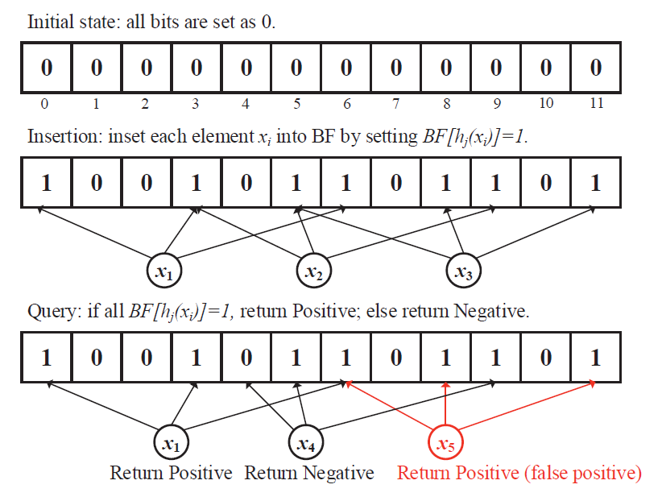

# What Is a Bloom Filter?

A Bloom filter is a data structure that helps determine if an element is almost certainly not in a dataset. It employs one or more hashing functions and an array of bits. As a "filter," it serves as an initial test for data entry.

In many computer science scenarios, we search for a small amount of data within a vast dataset. Software engineers aim to optimize this search by exploring new data structures, technologies, and processes to achieve minimal latency and high throughput. A Bloom filter helps optimize the search operation in certain use cases.

Imagine you're setting up a new account on a social media website to connect with your peers. You enter a username, but a message appears saying, "Sorry, that username is already in use." You try adding your date of birth to the username, but it still doesn't work. In this scenario, a Bloom filter algorithm is being used.

## How Does a Bloom Filter Work?
Here are the steps involved in how a Bloom filter works:

1. Accept the Input:
The first step is to accept the input. For instance, if the input is the string "John Doe," this will be processed by the Bloom filter.
2. Generate the Hash Value:
The algorithm then hashes the input to produce a numerical value. For instance, "John Doe" might be hashed to a value like 1355. The exact value is derived from hashing algorithms, which differ in their complexity.
3. Mod the hash by the array length:
The next step is to apply the modulo operation to the hash value using the length of the array (modulo finds the remainder of a division). In programming, this operation is denoted by %. For example, applying the modulo operation to the hash value of "John Doe" (1355) with an array length of 19 yields an index within the bounds of the bit array
4. Insert the hash:
We insert the hash into the mod value of the array. Therefore, the sixth position in the array goes from 0 to 1. 
5. Search for the value (i.e., lookup):
steps 2 and 3 are performed again as part of the lookup process. This time, the algorithm checks the content of the array as per the mod results. If the value is 0, the input cannot conceivably belong to the set. Nonetheless, if the bit is 1, the input may be an element of a set. The operation (e.g., setting a password or creating an email ID) is allowed only when the output comes as 0.

## How to run the code
[CHECH HERE](HOWTORUN.md)
